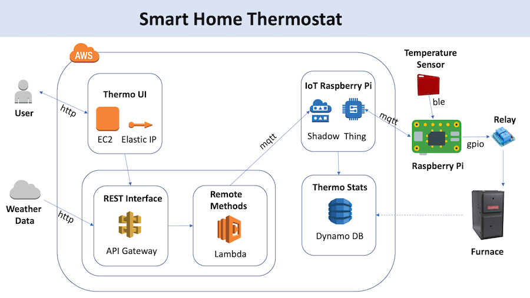
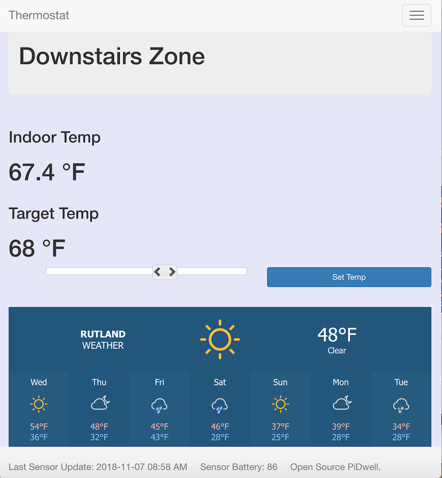
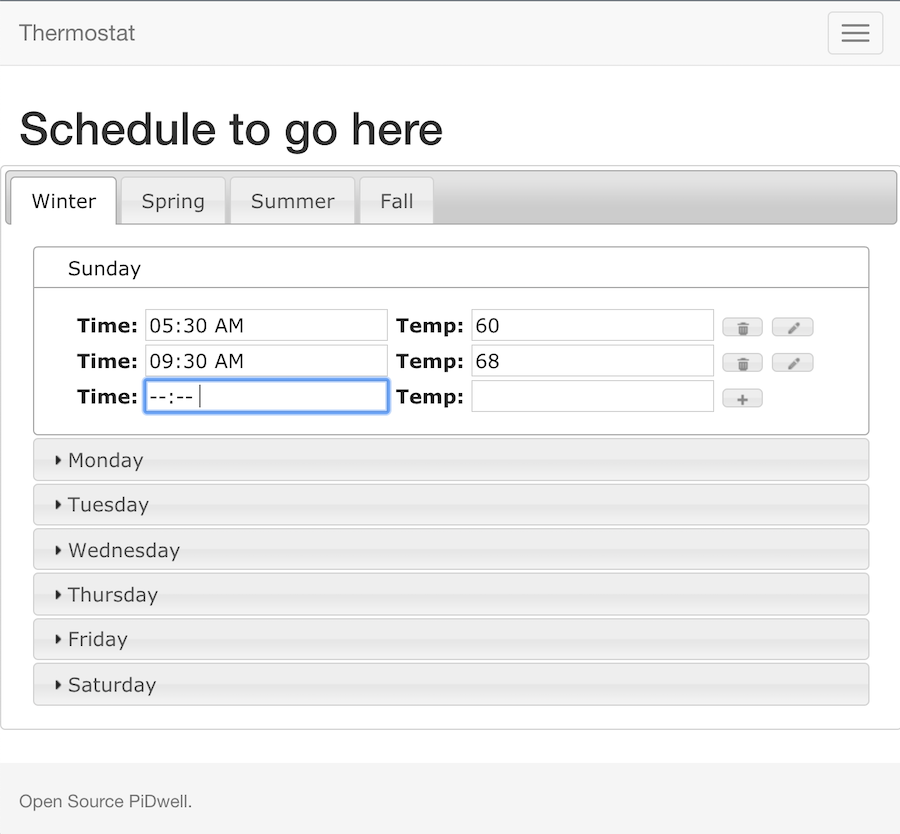

# Smart Home Thermostat

## Architecture

The Smart Home Thermostat is a simplified version of the Nest Thermostat. That uses AWS infrastructure to create a cloud enabled IoT Thermostat device.

An EC2 Instance runs a Python Flask based web site for administration of the Thermostat. Currently we have only one Pi connected but the site is configured to manage multiple devices.

The Website communicates to the Pi through a restful services API using Lambada Functions also written in Python. These simple functions use an MQTT client to interface with an AWS IoT Thing that securely connects to the Pi.

The Pi in turn connects to a Texas Instruments Sensor for Room Temperature data using BLE (This sensor is currently the weak link in the system as the Battery life of the device is poor.) The Pi uses a simple relay to actuate the furnace on and off.

The furnace run time stats (when the furnace was on or off) where being sent back to a Dynamo DB instance for further optimization of the schedule. This components is currently not available.

A final component provides current weather data and displays this on the Website.

## Design

The thermostat has a simple user interface allowing you to easily set or check any of the zones current temperatures.

Each Zone has a four (4) season schedule that allows for setting specific temperature set-points on any day and at any time. Additionally these schedules can be adjusted by season (Summer, Fall, Winter, Spring).

A fifth (5) Away Schedule is also provided that allows you to easily set the whole house (all zones) to a schedule best suited for when the home is unoccupied.

__Note__: The schedule is currently manually defined in a JSON file. The below interface will enable configuration from the website. (This feature is not currently fully coded.)

A simple logon screen is provided for the site.
